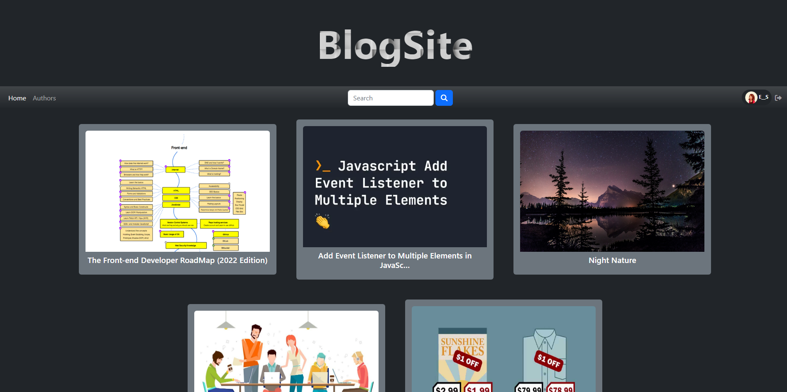
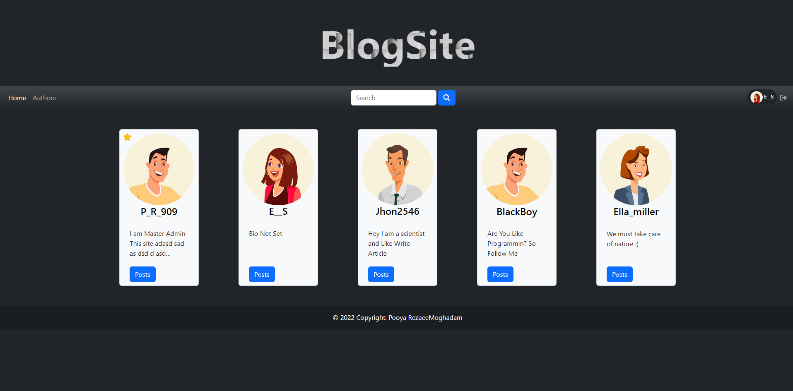
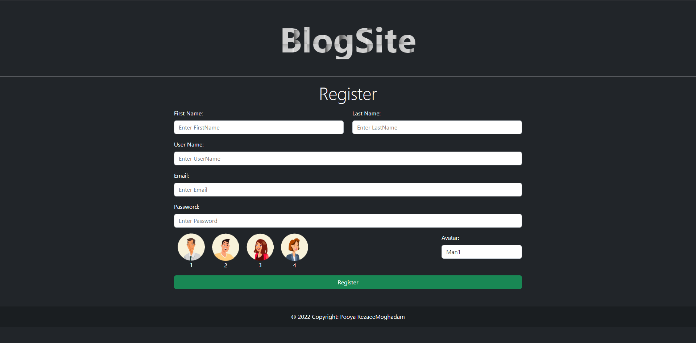
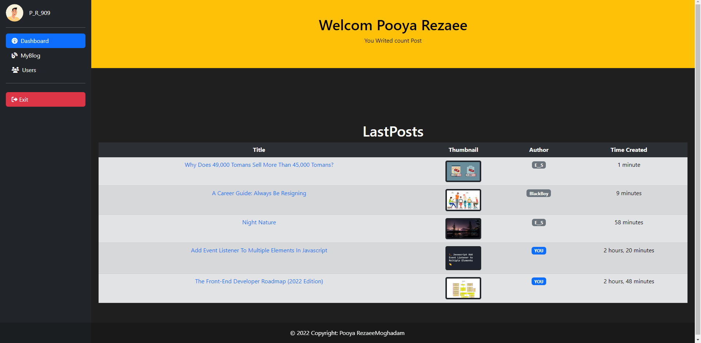

# BlogSite-Django
A Simple BlogSite Develop With Django

## Pictures
          |  
:-------------------------------------------:|:------------------------------------------:
  |  

## Install & Run :
```
git clone https://github.com/PooyaRezaee/BlogSite-Django.git

cd BlogSite-Django

pip install -r requirements.txt

python manage.py makemigrations

python manage.py migrate

python manage.py runserver

```